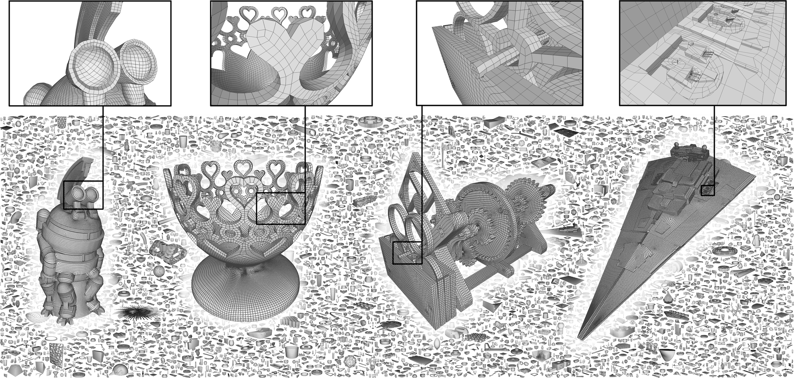

# Reliable Feature-Line Driven Quad-Remeshing

[Nico Pietroni](https://profiles.uts.edu.au/Nico.Pietroni), Stefano Nuvoli, 
[Thomas Alderighi](http://vcg.isti.cnr.it/~alderighi/), [Paolo Cignoni](http://vcg.isti.cnr.it/~cignoni/), [Marco Tarini](https://tarini.di.unimi.it/)<br/>
*SIGGRAPH 2021*<br/>



## Abstract
We present a new algorithm for the semi-regular quadrangulation of an input surface, driven by its line features, such as sharp creases. We define a perfectly feature-aligned cross-field and a coarse layout of polygonal-shaped patches where we strictly ensure that all the feature-lines are represented as patch boundaries. To be able to consistently do so, we allow non-quadrilateral patches and T-junctions in the layout; the key is the ability to constrain the layout so that it still admits a globally consistent, T-junction-free, and pure-quad internal tessellation of its patches. This requires the insertion of additional irregular-vertices inside patches, but the regularity of the final- mesh is safeguarded by optimizing for both their number and for their reciprocal alignment. In total, our method guarantees the reproduction of feature-lines by construction, while still producing good quality, isometric, pure-quad, conforming meshes, making it an ideal candidate for CAD models. Moreover, the method is fully automatic, requiring no user intervention, and remarkably reliable, requiring little assumptions on the input mesh, as we demonstrate by batch processing the entire Thingi10K repository, with less than 0.5% of the attempted cases failing to produce a usable mesh.

Website: [https://www.quadmesh.cloud/](https://www.quadmesh.cloud/)<br />
DOI: [10.1145/3450626.3459941](https://doi.org/10.1145/3450626.3459941) ACM Transactions on Graphics (SIGGRAPH), 2021

**BibTex**
```
@article{10.1145/3450626.3459941,
author = {Pietroni, Nico and Nuvoli, Stefano and Alderighi, Thomas and Cignoni, Paolo and Tarini, Marco},
title = {Reliable Feature-Line Driven Quad-Remeshing},
year = {2021},
issue_date = {August 2021},
publisher = {Association for Computing Machinery},
address = {New York, NY, USA},
volume = {40},
number = {4},
issn = {0730-0301},
url = {https://doi.org/10.1145/3450626.3459941},
doi = {10.1145/3450626.3459941},
abstract = {We present a new algorithm for the semi-regular quadrangulation of an input surface, driven by its line features, such as sharp creases. We define a perfectly feature-aligned cross-field and a coarse layout of polygonal-shaped patches where we strictly ensure that all the feature-lines are represented as patch boundaries. To be able to consistently do so, we allow non-quadrilateral patches and T-junctions in the layout; the key is the ability to constrain the layout so that it still admits a globally consistent, T-junction-free, and pure-quad internal tessellation of its patches. This requires the insertion of additional irregular-vertices inside patches, but the regularity of the final-mesh is safeguarded by optimizing for both their number and for their reciprocal alignment. In total, our method guarantees the reproduction of feature-lines by construction, while still producing good quality, isometric, pure-quad, conforming meshes, making it an ideal candidate for CAD models. Moreover, the method is fully automatic, requiring no user intervention, and remarkably reliable, requiring little assumptions on the input mesh, as we demonstrate by batch processing the entire Thingi10K repository, with less than 0.5% of the attempted cases failing to produce a usable mesh.},
journal = {ACM Trans. Graph.},
month = {jul},
articleno = {155},
numpages = {17},
keywords = {geometry processing, quad-meshing, modelling}
}
```

### Download
```bash
git clone --recursive https://github.com/stefanonuvoli/quadwild
```

### Build
The following libraries are requested:
- `vcglib`: [https://github.com/cnr-isti-vclab/vcglib](https://github.com/cnr-isti-vclab/vcglib)
- `gurobi`: [https://www.gurobi.com](https://www.gurobi.com)

TODO

## Note
The code has slightly changed and the results could be different from the ones showed in the paper.

## License
[GPL3](LICENSE) licensed
([FAQ](https://www.gnu.org/licenses/gpl-faq.html))


